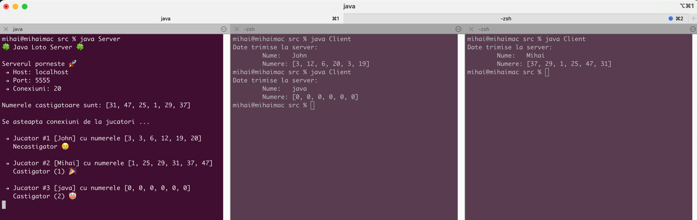

# fmi-retele
Proiect la disciplina "Retele de calculatoare" – an II ID @ FMI

## Continut
1. [Cerinte proiect](#cerinte)
2. [Descriere proiect](#descriere-proiect)
3. [Video demo](#video-demo)

----

### Cerinte 
O arhivă conținănd:
- Programe `.java`
- Un `.docx` cu descrierea programului

Programul trebuie să conțină cât mai multe dintre subiectele prezentate:
- Fluxuri, serializare
- Fire de executare
- Clienti - Server
- Interfete grafice, evenimente
- Resurse comune pe server accesate "simultan" de client
- Metode de rezolvare a problemelor de concurență: monitoare, semafoare

### Descriere proiect
#### Am implementat un joc simplu de **Loto 6/49** 🍀

**Serverul** generează numerele câștigătoare la instanțiere și apoi deschide conexiuni pentru **clienti**.

**Clientii**, prin interfața grafică, introduc numele și aleg cele 6 numere.
Aceste numere sunt trimise la server, unde se verifică dacă sunt câștigătoare.

#### 🥚 Easter egg
Folosețte numele `java` pentru a câștiga la loto.

### Video demo
https://github.com/mihaituhari/fmi-retele/assets/12177811/bac202c2-8aa1-4276-a4cd-e6fee8edb79b
